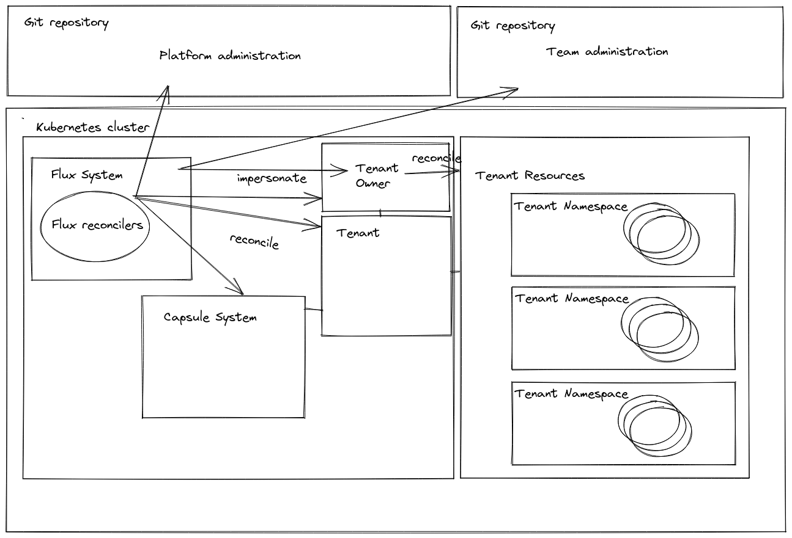

# GitOps multi-tenancy with [Flux v2](https://github.com/fluxcd/flux) and [Capsule](https://github.com/clastix/capsule)

> Forked from [fluxcd/flux2-multi-tenancy](https://github.com/fluxcd/flux2-multi-tenancy) repository.

Introduce the Tenant concept to GitOps multi-tenancy scenario with Flux v2.

## Architetcure

Please see [ARCHITECTURE.md](./docs/ARCHITECTURE.md).



## Quickstart

### Provision a cluster

```
kind create cluster
```

### Bootstrap Flux

```
export GITHUB_USER=<your-username>
export GITHUB_REPO=<repository-name>

flux bootstrap github \
    --owner=${GITHUB_USER} \
    --repository=${GITHUB_REPO} \
    --branch=main \
    --personal \
    --path=clusters/staging
```

### Overwite Flux configuration with multitenancy lockdown (from local repo)

```
git push origin main -f
```
